# Microsoft Sentinel SOC Incident Response Lab

### Enterprise Attack Detection & Incident Response | Microsoft Sentinel | Sysmon | Microsoft Azure | MITRE ATT&CK

---

## Business Challenge

A multinational organization recently migrated critical Windows infrastructure to Microsoft Azure to support its remote workforce. 

Following the migration, the Security Operations Center (SOC) began observing suspicious authentication attempts, PowerShell activity, registry modifications, scheduled task creation, and outbound network communications originating from a production Windows Server.

The security team required a complete investigation to determine whether the observed activities represented legitimate administrative behavior or a coordinated cyber attack.

The objective of this project was to simulate an enterprise attack, detect and investigate each stage using Microsoft Sentinel and Sysmon, correlate the resulting evidence, map observed adversary behavior to the MITRE ATT&CK framework, and perform incident response activities.

---

# Executive Summary

This project demonstrates an end-to-end Security Operations Center (SOC) investigation performed using Microsoft Sentinel and Sysmon endpoint telemetry collected from an Azure-hosted Windows Server.

A controlled attack scenario was simulated from external reconnaissance through initial access, PowerShell execution, system discovery, persistence, defense evasion, ingress tool transfer, and scheduled task abuse.

Microsoft Sentinel was used as the central security monitoring and investigation platform, while Sysmon provided detailed endpoint telemetry for process creation, network connections, file creation, and registry modifications.

The investigation used Kusto Query Language (KQL) to:

- Detect suspicious activity
- Investigate security events
- Correlate related telemetry
- Reconstruct the attack timeline
- Analyze process lineage
- Identify Indicators of Compromise (IOCs)
- Validate persistence mechanisms
- Map observed activity to MITRE ATT&CK
- Support containment and eradication activities

The investigation successfully reconstructed the attack lifecycle and demonstrated a repeatable workflow applicable to enterprise SOC operations.

---

## Investigation Workflow

1. **Azure Environment Deployment**
2. **Reconnaissance**
3. **Initial Access (RDP)**
4. **PowerShell Execution**
5. **Discovery**
6. **Persistence**
7. **Defense Evasion**
8. **Ingress Tool Transfer**
9. **Scheduled Task Abuse**
10. **Threat Hunting**
11. **Incident Response**
12. **Post-Incident Validation**

Project Objectives

This investigation was designed to:

Build a Microsoft Sentinel monitoring environment
Deploy and configure Sysmon endpoint telemetry
Onboard an Azure Windows Server into Microsoft Sentinel
Simulate realistic attacker techniques
Detect attacker activity using KQL
Correlate multiple Windows and Sysmon Event IDs
Perform endpoint-focused threat hunting
Reconstruct the attack timeline
Identify and validate Indicators of Compromise (IOCs)
Map observed activity to the MITRE ATT&CK framework
Perform containment and eradication activities
Validate that malicious activity had ceased
Document the investigation as an enterprise SOC incident response case
Scope

The investigation covered the simulated attack lifecycle within an isolated Microsoft Azure environment.

Environment
Microsoft Azure
Windows Server
Kali Linux
Security Monitoring
Microsoft Sentinel
Azure Log Analytics
Azure Monitor Agent
Sysmon
Investigation
Kusto Query Language (KQL)
Windows Security Event Logs
Sysmon telemetry
Process analysis
Network connection analysis
Registry analysis
File creation analysis
Threat hunting
MITRE ATT&CK mapping
Technology Stack
Category	Technologies
Cloud Infrastructure	Microsoft Azure
Target Endpoint	Windows Server
Attacker Platform	Kali Linux
SIEM	Microsoft Sentinel
Log Analytics	Azure Log Analytics
Endpoint Telemetry	Sysmon
Log Collection	Azure Monitor Agent
Query Language	Kusto Query Language (KQL)
Attack / Administration Tools	PowerShell, Nmap, BITSAdmin, RDP
Persistence Mechanisms	Registry Run Keys, Scheduled Tasks
Framework	MITRE ATT&CK
Investigation Methodology

The investigation followed a structured SOC workflow beginning with infrastructure deployment and ending with incident response and post-incident validation.

The investigation stages were:

## Technology Stack

### Environment
- Microsoft Azure
- Windows Server
- Kali Linux

### Security Monitoring
- Microsoft Sentinel
- Azure Log Analytics
- Azure Monitor Agent
- Sysmon

### Investigation & Detection
- Kusto Query Language (KQL)
- Windows Security Event Logs
- Sysmon telemetry
- Process analysis
- Network connection analysis
- Registry analysis
- File creation analysis
- Threat hunting
- MITRE ATT&CK mapping

### Attack / Administration Tools
- PowerShell
- Nmap
- BITSAdmin
- RDP

### Persistence Mechanisms
- Registry Run Keys
- Scheduled Tasks

## Investigation Methodology

The investigation followed a structured SOC workflow beginning with infrastructure deployment and progressing through reconnaissance, initial access, execution, discovery, persistence, defense evasion, threat hunting, incident response, and post-incident validation.

### Investigation Stages

1. Environment Deployment
2. Reconnaissance
3. Initial Access
4. PowerShell Execution
5. Discovery
6. Persistence
7. Defense Evasion
8. Ingress Tool Transfer
9. Scheduled Task Abuse
10. Threat Hunting
11. Incident Response
12. Post-Incident Validation

# 1. Environment Deployment

The investigation was conducted within an isolated Microsoft Azure environment designed to simulate an enterprise Windows infrastructure.

The environment consisted of an Azure-hosted Windows Server used as the monitored endpoint and a Kali Linux system used to simulate attacker activity.

Microsoft Sentinel was configured as the central SIEM platform for collecting, querying, and investigating security telemetry generated during the attack simulation.

---

## 1.1 Azure Windows Server Deployment

The Windows Server was deployed within Microsoft Azure and configured as the primary target system for the investigation.

The server served as the monitored endpoint where authentication activity, PowerShell execution, process creation, network connections, file creation, registry modifications, and persistence mechanisms were generated.

### Evidence

Successful Azure Windows Server deployment:

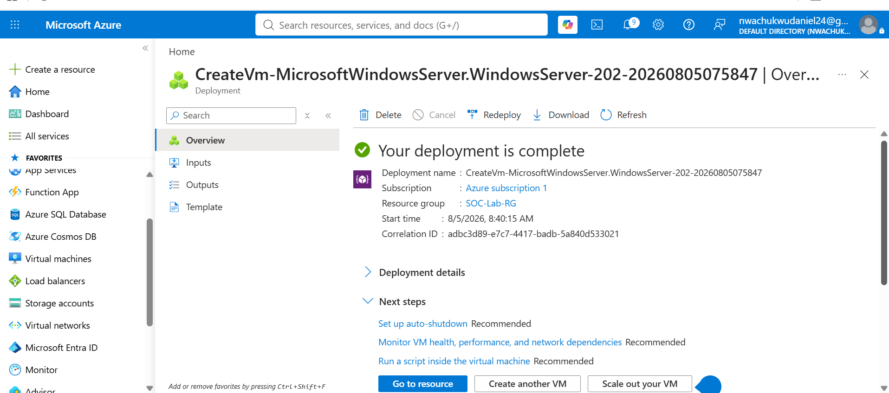

Windows Server environment:

---

## 1.2 Microsoft Sentinel Configuration

Microsoft Sentinel was configured to provide centralized security monitoring and investigation capabilities.

The environment was connected to Azure Log Analytics to allow Windows and Sysmon telemetry to be collected and queried using Kusto Query Language (KQL).

### Evidence

Microsoft Sentinel workspace configuration:

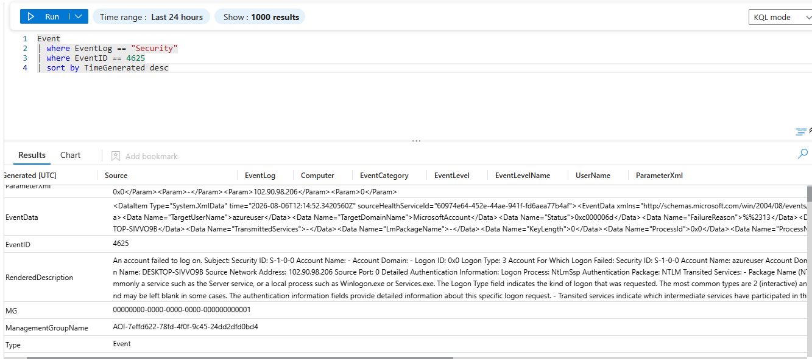

Log Analytics configuration:

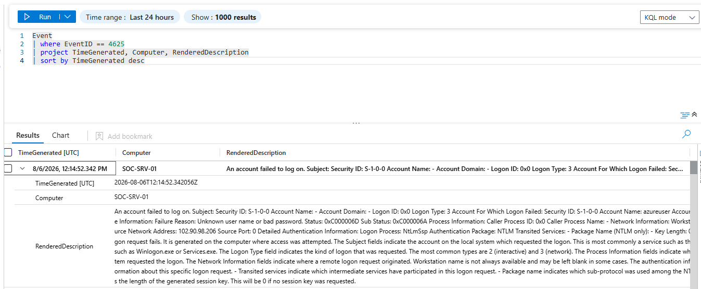

---

## 1.3 Sysmon Deployment

Sysmon was deployed on the Windows Server to provide detailed endpoint telemetry beyond the standard Windows Security Event Logs.

The telemetry generated by Sysmon was used throughout the investigation to analyze:

- Process creation
- Process relationships
- Network connections
- File creation
- Registry modifications
- PowerShell activity
- Suspicious command execution

This endpoint telemetry was subsequently collected and investigated through Microsoft Sentinel.

### Evidence

Sysmon installation and configuration:

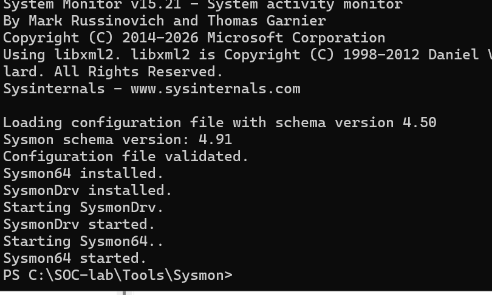

Sysmon operational telemetry:

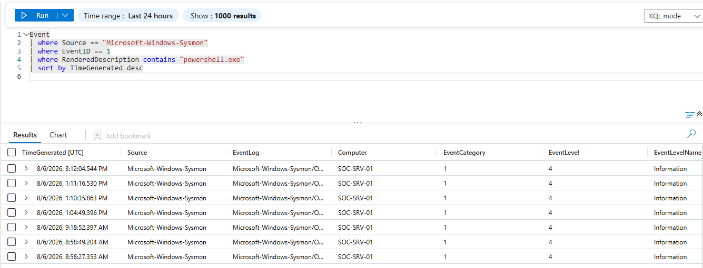

---

# 2. Reconnaissance

The first stage of the simulated attack involved reconnaissance against the target environment.

The objective was to identify information that could assist an attacker in determining the target's network exposure, available services, and potential entry points.

The reconnaissance phase included:

- Port and service enumeration
- Public IP information gathering
- Reverse DNS enumeration
- Targeted RDP port verification
- Advanced Nmap service and SYN scanning

---

## 2.1 Nmap Initial Port and Service Enumeration

Nmap was used to identify exposed ports and services associated with the target environment.

This provided an initial understanding of the attack surface and helped identify potentially accessible services.

### Evidence

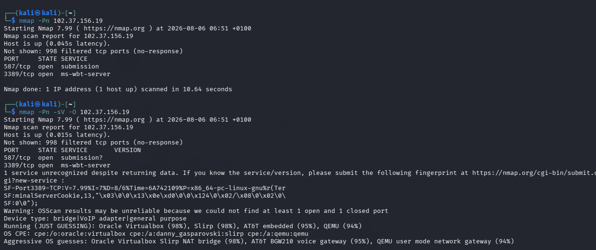

---

## 2.2 WHOIS Public IP Information Gathering

Public IP information was gathered to obtain additional information about the target's externally accessible infrastructure.

### Evidence

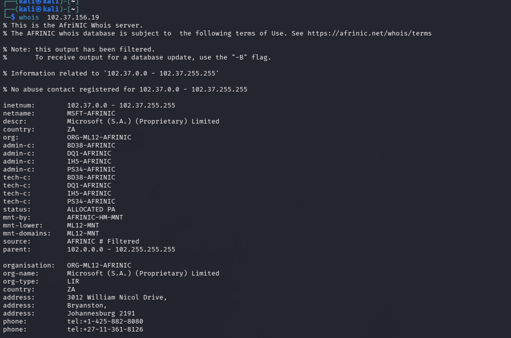

---

## 2.3 Reverse DNS Enumeration

Reverse DNS enumeration was performed to identify DNS information associated with the target IP address.

The activity helped provide additional context about the target infrastructure before attempting direct access.

### Evidence

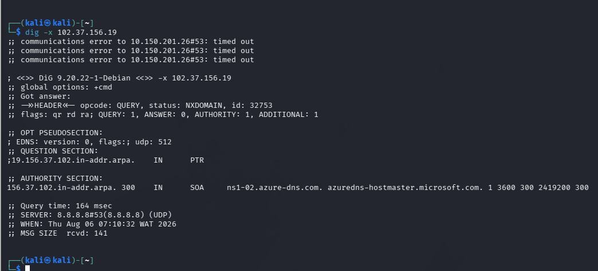

---

## 2.4 Targeted RDP Port Verification

The Remote Desktop Protocol (RDP) service was specifically tested because RDP would later be used as the simulated initial access vector.

The objective was to determine whether the RDP service was reachable from the attacker's environment.

### Evidence

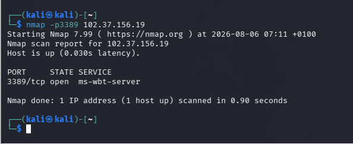

---

## 2.5 Advanced Nmap Service and SYN Scan

An advanced Nmap scan was performed to obtain additional information about exposed services and confirm the network attack surface.

The scan provided further visibility into the services that could potentially be targeted during subsequent stages of the simulation.

### Evidence

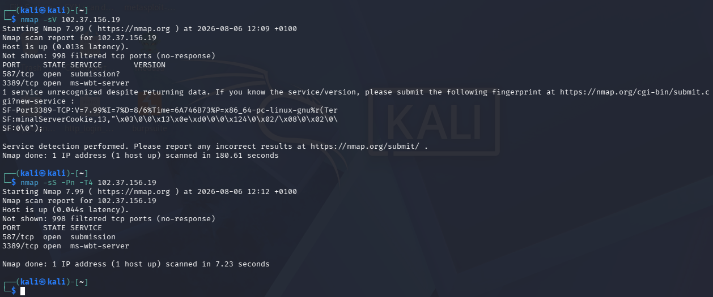

---

## Reconnaissance Findings

The reconnaissance phase established that the target environment exposed services that could potentially be used for further attack activity.

Of particular interest was the availability of Remote Desktop Protocol (RDP), which became the focus of the subsequent initial-access phase.

The reconnaissance findings therefore provided the transition point from external discovery into attempted authentication and initial access.

---

### MITRE ATT&CK Mapping — Reconnaissance

| Activity | MITRE ATT&CK Phase | Technique |
|---|---|---|
| Network/service enumeration | Reconnaissance | Network Information Discovery |
| Public IP information gathering | Reconnaissance | Gather Victim Network Information |
| DNS enumeration | Reconnaissance | Gather Victim Network Information |
| RDP service identification | Reconnaissance | Gather Victim Network Information |
| Nmap scanning | Reconnaissance | Network Service Scanning |

---

# Transition to Initial Access

Following reconnaissance, the attacker had identified RDP as a potentially accessible remote service.

The investigation therefore proceeded to the **Initial Access** phase, where repeated RDP authentication attempts were generated and analyzed through Microsoft Sentinel.

---

3. Initial Access

Following reconnaissance, the attacker identified Remote Desktop Protocol (RDP) as an exposed remote service on the target Windows Server.

The objective of this phase was to simulate repeated authentication attempts against the exposed RDP service and determine whether the activity could be detected and investigated through Microsoft Sentinel and Windows security telemetry.

3.1 RDP Authentication Attempt

The attacker initiated an RDP connection toward the Windows Server.

The initial connection attempt established the conditions required to generate authentication telemetry on the target endpoint.

Evidence

3.2 Failed RDP Authentication

The target rejected the attempted authentication.

Failed authentication events were subsequently investigated in Microsoft Sentinel to determine:

Which account was targeted
Source IP address
Destination host
Authentication status
Number of failed attempts
Associated Windows Security Event IDs
Whether the activity represented isolated failure or repeated attack behavior
Evidence

3.3 Repeated Authentication Attempts

Multiple authentication attempts were generated against the exposed RDP service.

From a SOC perspective, repeated failures against the same account or endpoint can indicate:

Password guessing
Brute-force activity
Credential stuffing
Unauthorized remote-access attempts

The activity was therefore investigated as a potential initial-access attempt rather than treating each authentication failure as an isolated event.

Evidence

3.4 Microsoft Sentinel Investigation

Microsoft Sentinel was used to investigate the authentication activity generated during the simulation.

KQL was used to filter Windows security telemetry and identify relevant authentication events associated with the target system.

The investigation focused on correlating:

Source host
Destination host
Account name
Authentication result
Event timestamp
Logon type
Source network information

This allowed the authentication activity to be investigated from the perspective of a SOC analyst rather than relying solely on the visible RDP error.

Evidence

3.5 Authentication Event Analysis

The Windows authentication telemetry provided additional context surrounding the failed login attempts.

The investigation examined the relevant Windows Security events to determine whether the activity was consistent with an unauthorized remote-access attempt.

The following information was considered during analysis:

Event ID
Account targeted
Source address
Destination workstation
Logon type
Failure reason
Timestamp
3.6 Initial Access Assessment

The authentication activity demonstrated that the exposed RDP service represented a viable attack surface.

The observed failed authentication attempts were treated as suspicious because they originated from the simulated attacker environment and occurred as part of the broader attack sequence.

The activity therefore established the Initial Access stage of the simulated attack chain.

MITRE ATT&CK Mapping — Initial Access
Activity	MITRE ATT&CK Technique	Description
RDP connection attempt	T1133	External Remote Services
Repeated authentication attempts	T1110	Brute Force
Remote authentication activity	T1021.001	Remote Services: RDP
SOC Analyst Perspective

From a SOC analyst perspective, the investigation would not end after identifying a single failed RDP login.

The analyst would correlate the authentication activity with subsequent endpoint telemetry to determine whether the attacker eventually obtained access and what actions were performed after authentication.

The investigation therefore proceeded to PowerShell Execution, where endpoint telemetry was analyzed for suspicious command execution following the initial-access activity.

Transition to PowerShell Execution

The next stage of the investigation focused on identifying attacker-controlled PowerShell activity on the Windows Server.

The objective was to determine:

What PowerShell commands were executed
Which user initiated the process
What parent process launched PowerShell
Whether external resources were accessed
Whether the activity was consistent with legitimate administration or malicious behavior

# 4. PowerShell Execution

Following the initial-access phase, the investigation moved to PowerShell activity observed on the Windows Server.

PowerShell is a legitimate Windows administration framework, but its ability to execute commands, access remote resources, interact with the registry, create files, and modify system configuration makes it a common component of post-compromise activity.

The objective of this phase was to determine whether PowerShell activity observed on the endpoint was consistent with legitimate administration or represented attacker-controlled execution.

---

## 4.1 PowerShell Process Creation

Sysmon process telemetry was examined to identify PowerShell processes created on the Windows Server.

The investigation focused on:

- PowerShell executable
- Command-line arguments
- Parent process
- User context
- Process ID
- Creation timestamp
- Associated network activity

### Evidence

---

## 4.2 PowerShell Command-Line Analysis

The PowerShell command line was examined to determine what actions were performed by the process.

Command-line analysis is particularly important during endpoint investigation because the process name alone does not establish malicious intent.

The analyst therefore examined the command-line parameters and surrounding process telemetry to determine the purpose of the execution.

### Evidence

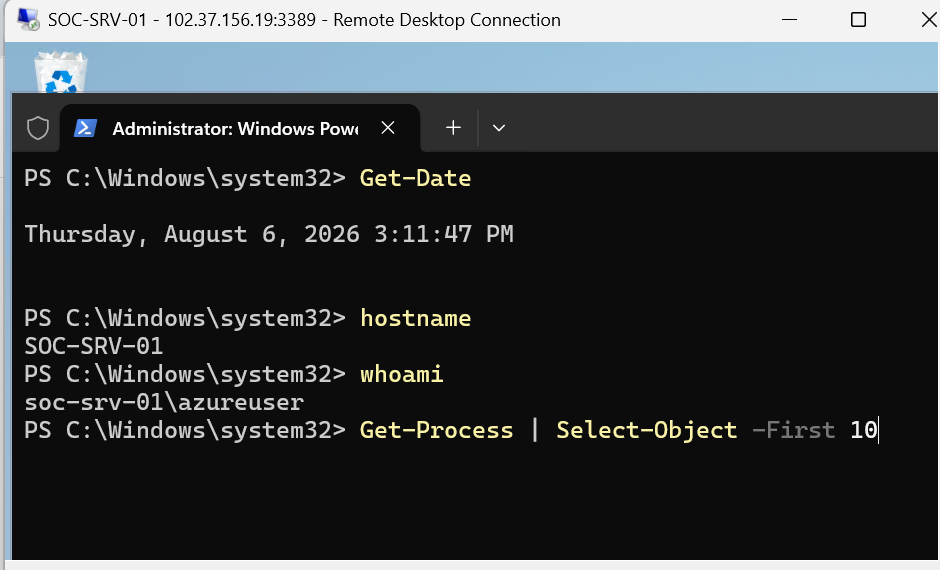

---

## 4.3 PowerShell Network Activity

PowerShell network activity was investigated to determine whether the process established connections to external resources.

The investigation considered:

- Destination IP address
- Destination port
- Process ID
- Process name
- Connection timestamp
- Associated command execution

This allowed PowerShell process activity to be correlated with network telemetry.

### Evidence

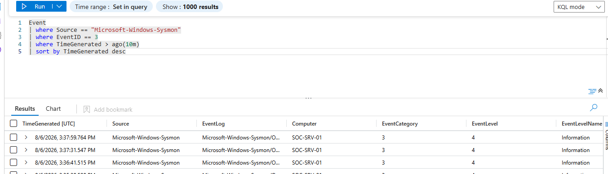

---

## 4.4 Invoke-WebRequest Activity

The investigation included simulation of PowerShell's `Invoke-WebRequest` functionality to demonstrate how a compromised endpoint could retrieve content from an external web resource.

The simulated command was directed toward a benign test resource.

Example:

Invoke-WebRequest -Uri "https://example.com"

The purpose of the simulation was to generate endpoint and network telemetry that could subsequently be investigated through Microsoft Sentinel.

Evidence

4.5 Microsoft Sentinel PowerShell Investigation

Microsoft Sentinel was used to search the collected endpoint telemetry for PowerShell-related activity.

KQL queries were used to identify PowerShell processes and investigate the surrounding events.

The investigation examined:

PowerShell execution
Command-line arguments
Process relationships
Network connections
Execution timestamps
User context

The resulting telemetry was correlated with the broader attack timeline to determine whether the PowerShell activity occurred after the simulated initial-access stage.

Evidence

4.6 Process Lineage Analysis

Process lineage was examined to determine how PowerShell was launched.

Understanding the parent-child process relationship provides important context during incident triage.

For example, an analyst would investigate whether PowerShell was launched by:

An interactive user
Remote Desktop activity
Command Prompt
Another scripting interpreter
A scheduled task
An Office application
Another potentially suspicious process

The process relationship was therefore considered alongside the command line and execution timestamp.

## 4.7 PowerShell Detection Methodology

The detection process followed a structured endpoint investigation workflow:

1. PowerShell Process Detected
2. Identify Process ID
3. Review Command Line
4. Identify Parent Process
5. Identify User Context
6. Check Network Connections
7. Correlate Timestamps
8. Determine Intent
9. Map to MITRE ATT&CK

This approach prevents the analyst from treating every PowerShell execution as malicious and instead evaluates the complete process context.

PowerShell Investigation Findings

The investigation demonstrated how legitimate PowerShell functionality can generate valuable endpoint telemetry for SOC detection and threat hunting.

The combination of Sysmon process telemetry, command-line information, network connection data, and Microsoft Sentinel provided sufficient context to investigate PowerShell execution as part of the broader attack sequence.

The investigation then progressed to Discovery, where commands executed on the endpoint were analyzed to determine what information an attacker attempted to collect after gaining access.

MITRE ATT&CK Mapping — PowerShell
Activity	MITRE ATT&CK Technique	Description
PowerShell execution	T1059.001	Command and Scripting Interpreter: PowerShell
PowerShell command execution	T1059.001	Command and Scripting Interpreter: PowerShell
Web request from PowerShell	T1105	Ingress Tool Transfer
External resource access	T1105	Transfer of tools/files from a remote resource
Transition to Discovery

After establishing PowerShell execution, the investigation focused on identifying commands used to enumerate the Windows environment.

The next phase examined whether the attacker attempted to discover:

Local users
System information
Network configuration
Running processes
Services
Other information useful for further exploitation or lateral movement

# 5. Discovery

Following PowerShell execution, the investigation moved into the Discovery phase.

The objective was to determine what information an attacker attempted to collect from the compromised Windows Server after gaining access.

Discovery activity is important during incident response because attackers commonly enumerate the host before deciding what actions to perform next.

The investigation focused on identifying commands and processes associated with:

- Local user enumeration
- System information discovery
- Network configuration discovery
- Running process enumeration
- Service discovery
- Host and environment information

---

## 5.1 Local User Enumeration

The attacker used the Windows `net user` command to enumerate local user accounts on the compromised system.

Example command:

net user

The command can provide an attacker with information about accounts that may be useful for subsequent credential attacks, privilege escalation, or lateral movement.

Evidence

5.2 System Information Discovery

System information was examined to identify details about the compromised host.

Information of interest included:

Hostname
Operating system
System architecture
Processor information
Installed configuration
Domain or workgroup information

Example command:

systeminfo

This type of information can help an attacker understand the target environment and identify potential attack paths.

Evidence

5.3 Network Configuration Discovery

The network configuration of the Windows Server was examined to identify available interfaces, IP addresses, gateways, and other network information.

Example command:

ipconfig /all

Network configuration can provide useful information about the host's location within the environment and potential paths toward other systems.

Evidence

5.4 Process Enumeration

Running processes were examined to identify applications and services currently executing on the endpoint.

Example command:

tasklist

Process enumeration can help an attacker identify:

Security software
Administrative tools
Running applications
Services
Potential targets for process injection or abuse

From a SOC perspective, process enumeration also provides useful evidence for determining the attacker's post-compromise objectives.

Evidence

5.5 Service Discovery

Windows services were examined to identify services currently installed or running on the endpoint.

Example command:

Get-Service

Service information may help an attacker identify privileged services, security controls, or services that could potentially be abused for persistence or privilege escalation.

Evidence

5.6 Discovery Activity Investigation in Microsoft Sentinel

Microsoft Sentinel was used to investigate the endpoint telemetry associated with the discovery commands.

The investigation correlated:

Process creation events
PowerShell execution
Command-line arguments
User context
Process IDs
Execution timestamps

The objective was to determine whether the discovery commands were executed as part of the simulated attack sequence.

Evidence

### Discovery Investigation Methodology

The investigation followed a process-oriented approach:

1. **Discovery Command Detected**
2. **Identify Executing Process**
3. **Review Command Line**
4. **Identify User Context**
5. **Correlate Process ID**
6. **Review Execution Timestamp**
7. **Correlate With Previous Activity**
8. **Determine Attacker Intent**
This approach allowed the discovery commands to be evaluated within the context of the complete attack timeline rather than being treated as isolated administrative commands.

Discovery Findings

The discovery phase demonstrated post-compromise enumeration of the Windows environment.

The observed commands provided information that could assist an attacker in understanding:

Who has accounts on the system
What operating system is running
How the host is configured
What processes are active
What services are available
How the endpoint is connected to the network

The collected information could subsequently be used to support privilege escalation, persistence, defense evasion, or lateral movement.

MITRE ATT&CK Mapping — Discovery
Activity	MITRE ATT&CK Technique	Description
Local user enumeration	T1087.001	Account Discovery: Local Account
System information gathering	T1082	System Information Discovery
Network configuration discovery	T1016	System Network Configuration Discovery
Process enumeration	T1057	Process Discovery
Service enumeration	T1007	System Service Discovery
Transition to Persistence

After establishing that the attacker had obtained information about the compromised Windows environment, the investigation moved to Persistence.

The next phase examined whether the attacker attempted to establish mechanisms that would allow malicious activity to survive logoff, reboot, or loss of the original access session.

The investigation focused particularly on Windows Registry Run Keys and other mechanisms capable of automatically executing a program when a user logs on.

# 6. Persistence

Following the discovery phase, the investigation examined whether the simulated attacker attempted to establish persistence on the Windows Server.

Persistence mechanisms allow an attacker to maintain access to a compromised system after logoff, reboot, or termination of the original session.

The investigation focused on Windows Registry Run Keys as a persistence mechanism and examined the resulting endpoint telemetry through Sysmon and Microsoft Sentinel.

---

## 6.1 Registry Run Key Persistence

The simulated attacker created a Registry Run Key that could cause a specified command or executable to execute automatically when the associated user logs on.

The activity was performed using PowerShell.

Example:

New-ItemProperty `
-Path "HKCU:\Software\Microsoft\Windows\CurrentVersion\Run" `
-Name "WindowsUpdate" `
-Value "powershell.exe -WindowStyle Hidden -Command <command>"

The registry modification was investigated as a potential persistence mechanism because the Windows Run registry location can be used to automatically launch programs during user logon.

Evidence

6.2 Registry Modification Detection

Sysmon registry telemetry was reviewed to identify the modification of the Windows Registry.

The investigation examined:

Registry path
Registry value name
Registry value data
Process responsible for the modification
User context
Process ID
Event timestamp

This information was used to establish whether the registry modification originated from the previously observed PowerShell activity.

Evidence

6.3 Microsoft Sentinel Persistence Investigation

Microsoft Sentinel was used to investigate the registry modification and correlate it with the PowerShell process responsible for creating the persistence mechanism.

The investigation correlated:

Sysmon registry events
PowerShell process creation
Command-line activity
User account
Process ID
Hostname
Event timestamps

The correlation provided evidence linking the persistence mechanism to the broader attack sequence.

Evidence

6.4 Persistence Validation

After identifying the Registry Run Key, the persistence mechanism was validated to determine whether the registry entry existed on the endpoint and whether it could trigger execution during user logon.

The validation process included reviewing the registry location and confirming the associated value.

Example:

Get-ItemProperty `
-Path "HKCU:\Software\Microsoft\Windows\CurrentVersion\Run"

The command allowed the analyst to verify the presence of the suspicious Run Key.

### 6.5 Persistence Investigation Methodology

The investigation followed the following workflow:

1. **Registry Modification Detected**
2. **Identify Registry Path**
3. **Identify Registry Value**
4. **Identify Modifying Process**
5. **Review PowerShell Command Line**
6. **Identify User Context**
7. **Correlate Timestamp**
8. **Validate Persistence Mechanism**
9. **Determine Malicious Intent**
This approach allowed the analyst to establish both what was modified and which process performed the modification.

Persistence Findings

The investigation identified a Registry Run Key modification consistent with a persistence mechanism.

The activity was particularly significant because it followed the previously observed PowerShell execution and discovery activity.

The correlation between the PowerShell process, registry modification, user context, and timestamps provided additional evidence that the activity formed part of the simulated post-compromise sequence.

MITRE ATT&CK Mapping — Persistence
Activity	MITRE ATT&CK Technique	Description
Registry Run Key modification	T1060 / T1547.001	Registry Run Keys / Startup Folder
PowerShell used to establish persistence	T1059.001	Command and Scripting Interpreter: PowerShell
Transition to Defense Evasion

After establishing persistence, the investigation examined whether the simulated attacker attempted to reduce visibility or conceal activity on the endpoint.

The next phase focused on Defense Evasion, including activity designed to manipulate or remove artifacts that could assist a SOC analyst during investigation.

The investigation therefore moved from identifying persistence to determining whether the attacker attempted to conceal evidence of their actions.

# 7. Defense Evasion

After establishing persistence, the investigation examined activity associated with defense evasion.

The objective of this phase was to determine whether the simulated attacker attempted to remove, modify, or conceal artifacts that could assist security analysts in reconstructing the attack.

Defense evasion is particularly important during incident response because an attacker may attempt to reduce forensic visibility after executing malicious activity.

---

## 7.1 Artifact Removal Activity

The simulated attacker performed cleanup activity against artifacts generated during the attack.

The investigation focused on identifying commands that could remove files, temporary artifacts, or other evidence associated with previous attacker activity.

Example:

Remove-Item "C:\Path\To\Artifact" -Force

The activity was investigated to determine whether the command was executed interactively or as part of the previously observed PowerShell activity.

7.2 PowerShell Evidence Collection

The PowerShell process responsible for the activity was examined using Sysmon telemetry.

The investigation considered:

Process creation time
Process ID
Parent process
User account
Command-line arguments
File operations
Associated network connections

This provided additional context for determining whether the cleanup activity was related to the simulated attack.

Evidence

7.3 Microsoft Sentinel Investigation

Microsoft Sentinel was used to search the endpoint telemetry associated with the defense-evasion activity.

KQL was used to identify PowerShell execution and correlate the process with surrounding endpoint events.

The investigation examined:

PowerShell process creation
Command-line activity
User context
Process relationships
Event timestamps
Related file activity
Evidence

7.4 Artifact Validation

The analyst validated whether the targeted artifact still existed on the endpoint after the simulated cleanup activity.

Example:

Test-Path "C:\Path\To\Artifact"

A result of:

False

would indicate that the specified file or artifact was no longer present at that location.

The result was considered alongside the original process telemetry rather than being treated as standalone evidence.

### 7.5 Defense Evasion Investigation Methodology

The investigation followed this workflow:

1. **Suspicious Cleanup Activity Detected**
2. **Identify Executing Process**
3. **Review PowerShell Command Line**
4. **Identify User Context**
5. **Identify Targeted Artifact**
6. **Review Sysmon Telemetry**
7. **Correlate With Previous Events**
8. **Validate Artifact State**
9. **Assess Defense Evasion**
This methodology allowed the analyst to determine whether artifact removal was connected to the simulated attack rather than assuming that every file deletion represented malicious activity.

Defense Evasion Findings

The investigation demonstrated how endpoint telemetry can be used to identify activity intended to reduce forensic visibility.

PowerShell execution, command-line information, process relationships, and file-state validation provided multiple sources of evidence for determining what occurred on the endpoint.

The activity was subsequently correlated with the broader attack timeline to determine its relationship to the persistence and discovery phases.

MITRE ATT&CK Mapping — Defense Evasion
Activity	MITRE ATT&CK Technique	Description
PowerShell execution	T1059.001	Command and Scripting Interpreter: PowerShell
File/artifact removal	T1070.004	Indicator Removal: File Deletion
Transition to Ingress Tool Transfer

Following the defense-evasion phase, the investigation examined whether the simulated attacker attempted to introduce additional content or tools onto the compromised Windows Server.

The next stage focused on Ingress Tool Transfer, including the use of Windows-native functionality to retrieve content from an external resource.

This activity was particularly relevant because legitimate administrative utilities can also be abused by attackers to transfer files without immediately introducing a traditional third-party download utility.

# 8. Ingress Tool Transfer

Following the defense-evasion activity, the investigation examined whether the simulated attacker attempted to transfer content from an external resource onto the compromised Windows Server.

The purpose of this phase was to demonstrate how legitimate Windows utilities can be abused to retrieve files while generating endpoint and network telemetry that can be investigated by a SOC.

The investigation focused on the use of **BITSAdmin** to initiate a file transfer.

---

## 8.1 BITSAdmin File Transfer

The simulated attacker used the Windows Background Intelligent Transfer Service (BITS) functionality to initiate a download from a remote resource.

BITS is a legitimate Windows component designed to perform background file transfers. Its legitimate functionality can also be abused by attackers to transfer tools or other files to a compromised endpoint.

Example:

bitsadmin /transfer UpdateJob /download /priority normal https://example.com/test.txt C:\Users\Public\test.txt

The activity was investigated to determine whether the BITS transfer was associated with the previously observed attacker activity.

8.2 BITSAdmin Process Execution

The endpoint telemetry was examined to identify the process responsible for initiating the transfer.

The investigation focused on:

Executable name
Process ID
Parent process
User context
Command-line arguments
Execution timestamp
Destination file
Network destination
Evidence

8.3 File Creation Analysis

Following the transfer attempt, the destination location was examined to determine whether a new file had been created on the endpoint.

The investigation considered:

File path
File name
File creation timestamp
File size
Creating process
User context

File creation telemetry was correlated with the BITSAdmin process to determine whether the downloaded content was successfully written to disk.

Evidence

8.4 Microsoft Sentinel Investigation

Microsoft Sentinel was used to investigate the BITSAdmin activity and correlate process and network telemetry.

The investigation searched for:

BITSAdmin execution
Process creation
Command-line arguments
Network connections
File creation
Execution timestamps
Source and destination information

The objective was to establish a relationship between the process that initiated the transfer, the remote resource contacted, and the resulting file activity.

Evidence

### 8.5 BITS Transfer Investigation Workflow

The investigation followed this workflow:

1. **BITSAdmin Execution Detected**
2. **Identify Process**
3. **Review Command Line**
4. **Identify Remote Resource**
5. **Identify Destination File**
6. **Review Network Telemetry**
7. **Review File Creation**
8. **Correlate Timestamps**
9. **Determine Transfer Activity**
This approach allowed the analyst to investigate the complete transfer operation rather than relying on a single process event.

8.6 SOC Investigation Perspective

From a SOC perspective, the presence of BITSAdmin does not automatically indicate malicious activity.

BITS is a legitimate Windows component and may be used by administrators and applications for legitimate file transfers.

The analyst therefore considered:

Who executed the process
What was downloaded
Where it came from
Where it was written
Why the transfer occurred
Whether the activity was expected
Whether the transfer occurred in conjunction with other suspicious events

The activity becomes significantly more suspicious when correlated with the preceding PowerShell, discovery, persistence, and defense-evasion activity.

Ingress Tool Transfer Findings

The investigation demonstrated how a legitimate Windows utility can be used as part of post-compromise activity to transfer content onto an endpoint.

Process telemetry, command-line information, network connections, and file creation evidence were correlated to establish the transfer activity and place it within the broader attack timeline.

MITRE ATT&CK Mapping — Ingress Tool Transfer
Activity	MITRE ATT&CK Technique	Description
BITSAdmin execution	T1105	Ingress Tool Transfer
Remote file retrieval	T1105	Ingress Tool Transfer
PowerShell-assisted transfer	T1059.001	Command and Scripting Interpreter: PowerShell
Transition to Scheduled Task Abuse

After transferring content to the endpoint, the investigation examined whether the attacker attempted to establish another execution or persistence mechanism.

The next phase focused on Scheduled Task Abuse, where Windows Task Scheduler functionality was investigated for suspicious task creation and execution.

This phase was particularly important because scheduled tasks can provide attackers with both persistence and recurring execution capabilities.

# 9. Scheduled Task Abuse

Following the ingress tool transfer phase, the investigation examined whether the attacker attempted to establish recurring execution through the Windows Task Scheduler.

Scheduled tasks are legitimate Windows functionality commonly used for system maintenance and administrative automation. However, attackers can abuse them to execute commands or programs automatically and establish persistence.

The objective of this phase was to identify suspicious scheduled-task creation, determine the process responsible for creating the task, and correlate the activity with the previously observed attacker behavior.

---

## 9.1 Scheduled Task Creation

The simulated attacker created a scheduled task on the Windows Server.

The activity was investigated to determine:

- Task name
- Task action
- Execution command
- Trigger configuration
- Creating process
- User context
- Creation timestamp

Example:

schtasks /create /tn "WindowsUpdateCheck" /tr "powershell.exe -Command <command>" /sc onlogon

The scheduled task was created for controlled lab purposes to demonstrate how this persistence technique can be detected through endpoint telemetry.

9.2 PowerShell-Based Scheduled Task Creation

PowerShell was also examined as a potential mechanism for creating the scheduled task.

Example:

$Action = New-ScheduledTaskAction -Execute "powershell.exe" -Argument "<command>"
$Trigger = New-ScheduledTaskTrigger -AtLogOn
Register-ScheduledTask -TaskName "WindowsUpdateCheck" -Action $Action -Trigger $Trigger

The use of PowerShell provided additional telemetry that could be correlated with the scheduled-task activity.

Evidence

9.3 Scheduled Task Enumeration

The analyst enumerated scheduled tasks on the endpoint to validate whether the suspicious task existed.

Example:

schtasks /query /fo LIST /v

This provided information about:

Task name
Task status
Task trigger
Task action
Run-as account
Next execution time
Last execution time

The resulting information was compared against the task identified during the investigation.

9.4 Microsoft Sentinel Investigation

Microsoft Sentinel was used to investigate the scheduled-task activity and correlate it with the surrounding endpoint telemetry.

The investigation examined:

Process creation
PowerShell execution
Scheduled task creation
Command-line arguments
User context
Process ID
Event timestamps

The objective was to determine whether the scheduled task was created by the same user or process associated with earlier attacker activity.

Evidence

### 9.5 Process Correlation

The scheduled-task creation event was correlated with the process responsible for creating it.

The investigation followed the process lineage:

1. **Scheduled Task Creation**
2. **Identify Creating Process**
3. **Identify Parent Process**
4. **Review Command Line**
5. **Identify User Context**
6. **Correlate Timestamp**
7. **Compare With Previous Attack Activity**
This process helped establish whether the scheduled task was an isolated administrative action or part of the simulated attack chain.

9.6 Persistence Validation

The analyst validated the scheduled task after creation to determine whether it remained present on the endpoint.

Example:

schtasks /query /tn "WindowsUpdateCheck" /fo LIST /v

The task configuration was reviewed to determine whether:

The task existed
The task was enabled
The configured action was present
The trigger was active
The task executed under an appropriate account

This validation provided additional evidence for the persistence assessment.

9.7 Scheduled Task Investigation Methodology

The investigation followed a structured workflow:

### Threat Hunting Methodology

The investigation followed a hypothesis-driven approach:

1. **Define Investigation Hypothesis**
2. **Search Relevant Telemetry**
3. **Identify Suspicious Events**
4. **Pivot Using Host / User / Process**
5. **Correlate Timestamps**
6. **Investigate Related Activity**
7. **Identify Additional Indicators**
8. **Reconstruct Attack Sequence**
9. **Determine Impact**
The scheduled-task phase demonstrated how legitimate Windows Task Scheduler functionality can be abused to establish recurring execution.

The investigation correlated task configuration, process creation, command-line information, user context, and timestamps to determine whether the activity was consistent with the simulated attack.

When viewed together with the preceding persistence, PowerShell, and ingress-tool-transfer activity, the scheduled task represented an additional mechanism that could allow an attacker to maintain execution on the compromised endpoint.

MITRE ATT&CK Mapping — Scheduled Task Abuse
Activity	MITRE ATT&CK Technique	Description
Scheduled task creation	T1053.005	Scheduled Task/Job: Scheduled Task
PowerShell execution	T1059.001	Command and Scripting Interpreter: PowerShell
Scheduled task used for persistence	T1053.005	Scheduled Task/Job: Scheduled Task
Transition to Threat Hunting

After investigating the individual attack stages, the investigation moved into Threat Hunting.

Rather than investigating each event independently, the analyst performed broader searches across the available endpoint telemetry to identify related activity that may not have generated a dedicated alert.

The threat-hunting phase focused on:

Suspicious PowerShell execution
Process relationships
Unusual command lines
Network connections
Registry modifications
File creation
Scheduled task activity
Authentication events
Indicators associated with the simulated attack

The objective was to determine whether additional attacker activity existed outside the events already identified during the investigation.

# 10. Threat Hunting

After investigating the individual attack stages, the investigation moved into a broader threat-hunting phase.

The objective was to determine whether additional attacker activity existed within the endpoint telemetry that had not already been identified through the initial investigation.

Rather than relying exclusively on individual alerts, the analyst searched across process, authentication, network, registry, file, and PowerShell telemetry to identify relationships between seemingly separate events.

---

## 10.1 Threat Hunting Objectives

The threat-hunting phase focused on identifying:

- Suspicious PowerShell execution
- Unusual command-line activity
- Process creation and parent-child relationships
- Network connections initiated by suspicious processes
- Registry modifications
- File creation activity
- Scheduled task creation
- Authentication anomalies
- Indicators associated with the simulated attack

The objective was to determine whether the observed events represented a coordinated attack sequence.

---

## 10.2 PowerShell Threat Hunting

PowerShell telemetry was searched to identify potentially suspicious commands and execution patterns.

The investigation examined:

- PowerShell process creation
- Command-line arguments
- Parent processes
- User context
- Execution timestamps
- Network connections associated with PowerShell

Example KQL investigation pattern:

Event
| where Source == "Microsoft-Windows-Sysmon"
| where EventID == 1
| where CommandLine contains "powershell"
| project TimeGenerated, Computer, User, Image, ParentImage, CommandLine
| order by TimeGenerated asc

This type of query allowed the analyst to identify PowerShell execution and examine the surrounding process context.

10.3 Suspicious Process Hunting

Process creation telemetry was searched for unusual or potentially suspicious processes.

The investigation considered:

Process name
Executable path
Parent process
Command line
User
Process ID
Creation timestamp

Example:

Event
| where Source == "Microsoft-Windows-Sysmon"
| where EventID == 1
| project TimeGenerated, Computer, User, Image, ParentImage, CommandLine, ProcessId
| order by TimeGenerated asc

The results were reviewed for processes that appeared inconsistent with normal administrative activity.

10.4 Network Connection Hunting

Sysmon network connection telemetry was examined to identify outbound connections associated with suspicious processes.

Example:

Event
| where Source == "Microsoft-Windows-Sysmon"
| where EventID == 3
| project TimeGenerated, Computer, User, Image, SourceIp, SourcePort, DestinationIp, DestinationPort
| order by TimeGenerated asc

The investigation focused on determining:

Which process initiated the connection
Destination IP address
Destination port
Connection timestamp
User context
Whether the connection corresponded with previously observed PowerShell or transfer activity
10.5 Registry Modification Hunting

Registry telemetry was searched for modifications associated with persistence.

Example:

Event
| where Source == "Microsoft-Windows-Sysmon"
| where EventID in (12, 13, 14)
| project TimeGenerated, Computer, User, Image, TargetObject, Details
| order by TimeGenerated asc

The results were correlated with the previously identified Registry Run Key persistence activity.

10.6 Scheduled Task Hunting

Scheduled-task activity was investigated to identify task creation associated with suspicious processes.

The analyst searched for process and command-line activity associated with:

schtasks.exe
powershell.exe
Register-ScheduledTask

The purpose was to determine whether additional scheduled tasks existed beyond the task identified during the primary investigation.

10.7 Authentication Hunting

Authentication telemetry was reviewed to identify suspicious login activity associated with the simulated attack.

The investigation considered:

Failed authentication attempts
Successful authentication events
Target account
Source address
Logon type
Timestamp
Hostname

The authentication activity was compared against the reconnaissance and initial-access stages to determine whether the events formed part of the same attack sequence.

10.8 Attack Timeline Correlation

The most important objective of the threat-hunting phase was to correlate events into a single attack timeline.

The investigation followed the sequence:

Reconnaissance
      │
      ▼
RDP Authentication Attempts
      │
      ▼
PowerShell Execution
      │
      ▼
System Discovery
      │
      ▼
Registry Persistence
      │
      ▼
Defense Evasion
      │
      ▼
Ingress Tool Transfer
      │
      ▼
Scheduled Task Abuse
      │
      ▼
Threat Hunting
      │
      ▼
Incident Response

The correlation of timestamps, processes, users, hosts, command lines, and network activity allowed the analyst to determine whether apparently separate events were part of the same simulated intrusion.

10.9 Threat Hunting Findings

The threat-hunting phase demonstrated the importance of investigating beyond individual alerts.

By searching the underlying telemetry, the analyst was able to examine the relationships between:

Authentication activity
PowerShell execution
Discovery commands
Registry modifications
File activity
Network connections
Scheduled tasks 

This broader approach provided additional context for the incident and supported reconstruction of the complete attack sequence.

Evidence

Threat Hunting Methodology

The investigation followed a hypothesis-driven approach:

Define Investigation Hypothesis
            │
            ▼
Search Relevant Telemetry
            │
            ▼
Identify Suspicious Events
            │
            ▼
Pivot Using Host / User / Process
            │
            ▼
Correlate Timestamps
            │
            ▼
Investigate Related Activity
            │
            ▼
Identify Additional Indicators
            │
            ▼
Reconstruct Attack Sequence
            │
            ▼
Determine Impact

This methodology mirrors a practical SOC threat-hunting workflow where analysts continuously pivot between related telemetry rather than investigating individual events in isolation.

MITRE ATT&CK Mapping — Threat Hunting
Activity	MITRE ATT&CK Technique	Description
PowerShell hunting	T1059.001	Command and Scripting Interpreter: PowerShell
Process discovery	T1057	Process Discovery
Network connection analysis	T1049	System Network Connections Discovery
Account activity analysis	T1087	Account Discovery
Scheduled task analysis	T1053.005	Scheduled Task/Job: Scheduled Task
Transition to Incident Response

The threat-hunting phase established sufficient evidence to treat the observed activity as a coordinated simulated security incident.

The investigation therefore progressed to Incident Response.

The response phase focused on:

Confirming the incident
Identifying affected assets
Establishing Indicators of Compromise
Containing attacker activity
Removing persistence mechanisms
Removing transferred artifacts
Terminating suspicious processes
Validating remediation
Performing post-incident verification

# 11. Incident Response

Following the threat-hunting phase, the investigation transitioned into incident response.

The objective was to contain the simulated compromise, remove attacker-controlled artifacts and persistence mechanisms, terminate suspicious processes, and validate that the endpoint had returned to a controlled state.

The response followed a structured SOC incident-response lifecycle:

Detection
   │
   ▼
Analysis
   │
   ▼
Containment
   │
   ▼
Eradication
   │
   ▼
Recovery
   │
   ▼
Validation
   │
   ▼
Lessons Learned

11.1 Incident Confirmation

The incident was confirmed by correlating multiple sources of endpoint telemetry rather than relying on a single event.

The investigation correlated:

RDP authentication activity
PowerShell execution
Process creation
Discovery commands
Registry modifications
File activity
Network connections
Scheduled task activity

The correlation of these events established a consistent attack sequence across the monitored Windows endpoint.

11.2 Indicators of Compromise

The investigation extracted relevant indicators from the collected telemetry.

Indicators included:

Source IP addresses
Destination IP addresses
Hostnames
User accounts
Process names
File paths
Registry paths
Scheduled task names
Command-line arguments
Relevant timestamps

These indicators were used to support investigation, containment, and post-incident validation.

11.3 Containment

The first response objective was to prevent further attacker activity against the affected endpoint.

Containment actions included reviewing and restricting the attack path, terminating suspicious activity, and preventing identified persistence mechanisms from continuing to execute.

Where applicable, the following Windows commands were used during the controlled lab response.

Identify Active Network Connections
Get-NetTCPConnection |
Where-Object {$_.State -eq "Established"} |
Select-Object LocalAddress,LocalPort,RemoteAddress,RemotePort,OwningProcess

This was used to identify active connections that could be associated with suspicious processes.

Identify Suspicious Processes
Get-Process |
Select-Object Id,ProcessName,Path

Process information was reviewed to identify processes associated with the simulated attack.

Terminate a Confirmed Malicious Process

After validating that a process was associated with the simulated malicious activity, it could be terminated using:

Stop-Process -Id <PID> -Force

The <PID> value was replaced with the confirmed process ID identified during investigation.

The process was not terminated solely because it appeared unusual; process termination was performed only after correlating the process with the investigation evidence.

11.4 Persistence Removal

The identified Registry Run Key persistence mechanism was removed from the endpoint.

Before removal, the registry entry was validated:

Get-ItemProperty `
-Path "HKCU:\Software\Microsoft\Windows\CurrentVersion\Run"

After confirming that the identified value belonged to the simulated attack, it was removed:

Remove-ItemProperty `
-Path "HKCU:\Software\Microsoft\Windows\CurrentVersion\Run" `
-Name "WindowsUpdate"

The registry was then queried again to verify that the persistence mechanism had been removed.

11.5 Scheduled Task Removal

The suspicious scheduled task identified during the investigation was validated before removal.

Example:

schtasks /query /tn "WindowsUpdateCheck" /fo LIST /v

After confirming that the task was associated with the simulated attack, it was removed:

schtasks /delete /tn "WindowsUpdateCheck" /f

The task was then queried again to verify that it was no longer present.

11.6 Removal of Transferred Artifacts

Files transferred during the simulated attack were identified using the previously collected file path and process telemetry.

The analyst first validated the file:

Test-Path "C:\Users\Public\test.txt"

After confirming that the artifact was associated with the simulated attack, it was removed:

Remove-Item "C:\Users\Public\test.txt" -Force

The file state was then validated:

Test-Path "C:\Users\Public\test.txt"

A result of:

False

confirmed that the specified artifact was no longer present at that location.

11.7 Artifact and Persistence Validation

Following containment and eradication, the endpoint was checked for evidence that the previously identified attacker mechanisms had been removed.

The validation process included:

# Check Registry Run Keys
Get-ItemProperty `
-Path "HKCU:\Software\Microsoft\Windows\CurrentVersion\Run"

# Check scheduled tasks
schtasks /query /fo LIST /v

# Check running processes
Get-Process

# Check active network connections
Get-NetTCPConnection

# Verify removal of known artifact
Test-Path "C:\Users\Public\test.txt"

The objective was to confirm that the identified persistence mechanism, transferred artifact, suspicious process, and associated network activity had been addressed.

11.8 Microsoft Sentinel Post-Response Investigation

Microsoft Sentinel was used after remediation to search for continued evidence of the simulated attacker activity.

The analyst searched for:

Continued PowerShell execution
New suspicious process creation
New network connections
Re-created Registry Run Keys
New scheduled tasks
Additional authentication anomalies
Reappearance of previously identified indicators

The purpose of this step was to verify that remediation had not merely removed a single artifact while leaving the underlying activity active.

Evidence

11.9 Detection Validation

After remediation, the same detection logic used during the investigation was re-evaluated.

The analyst confirmed whether:

Previously identified processes were still executing
Suspicious PowerShell activity continued
Persistence mechanisms had returned
Scheduled tasks had been recreated
Network connections associated with the attack remained active
Previously identified indicators continued to appear in telemetry

This provided an additional layer of confidence that the simulated compromise had been contained.

11.10 Incident Response Evidence

The incident-response evidence demonstrated the transition from detection to active remediation.

The response process incorporated:

Evidence collection
Process investigation
Network investigation
Persistence identification
Artifact removal
Scheduled task removal
Process termination
Post-remediation validation
Evidence

Incident Response Findings

The incident-response phase demonstrated a complete workflow from identification of suspicious activity through containment, eradication, and post-remediation validation.

The response was evidence-driven.

Rather than immediately deleting artifacts or terminating processes, the analyst first established the relationship between the activity and the simulated attack.

This approach preserved the investigation context while allowing the confirmed attacker-controlled mechanisms to be removed in a controlled manner.

Post-Incident Validation

Following remediation, the endpoint was monitored for additional suspicious activity.

The validation process focused on determining whether the attacker could:

Re-establish persistence
Recreate scheduled tasks
Execute additional PowerShell commands
Establish new network connections
Reintroduce transferred artifacts
Generate additional suspicious authentication events

No remediation step was considered complete until the associated indicator or persistence mechanism was validated.

Incident Response Conclusion

The simulated incident progressed through multiple stages of the attack lifecycle, including reconnaissance, initial access, PowerShell execution, discovery, persistence, defense evasion, ingress tool transfer, and scheduled task abuse.

Microsoft Sentinel provided centralized investigation capabilities, while Sysmon supplied detailed endpoint telemetry required to reconstruct process, network, file, and registry activity.

The combination of these technologies enabled the analyst to move from individual detections to a correlated attack narrative and subsequently perform containment, eradication, and post-incident validation.

# 12. MITRE ATT&CK Mapping

The observed activities were mapped to the MITRE ATT&CK framework to provide a standardized representation of adversary behavior.

The mapping connects the technical evidence collected during the investigation with established attacker techniques and provides additional context for detection engineering and incident response.

---

## 12.1 Attack Technique Mapping

| Attack Stage | Activity Observed | MITRE ATT&CK Technique | Technique ID |
|---|---|---|---|
| Reconnaissance | Network and service enumeration | Network Service Scanning | T1046 |
| Initial Access | RDP authentication attempts | External Remote Services | T1133 |
| Initial Access | Repeated authentication attempts | Brute Force | T1110 |
| Initial Access | RDP access | Remote Services: RDP | T1021.001 |
| PowerShell Execution | PowerShell command execution | Command and Scripting Interpreter: PowerShell | T1059.001 |
| Discovery | Local account enumeration | Account Discovery: Local Account | T1087.001 |
| Discovery | System information collection | System Information Discovery | T1082 |
| Discovery | Network configuration enumeration | System Network Configuration Discovery | T1016 |
| Discovery | Process enumeration | Process Discovery | T1057 |
| Discovery | Service enumeration | System Service Discovery | T1007 |
| Persistence | Registry Run Key creation | Registry Run Keys / Startup Folder | T1547.001 |
| Defense Evasion | Artifact removal | Indicator Removal: File Deletion | T1070.004 |
| Ingress Tool Transfer | BITSAdmin file transfer | Ingress Tool Transfer | T1105 |
| Scheduled Task Abuse | Scheduled task creation | Scheduled Task/Job: Scheduled Task | T1053.005 |

---

## 12.2 Attack Lifecycle

The investigation reconstructed the simulated attack as a sequence of related activities:

01. Reconnaissance
        │
        ▼
02. Initial Access
        │
        ▼
03. PowerShell Execution
        │
        ▼
04. Discovery
        │
        ▼
05. Persistence
        │
        ▼
06. Defense Evasion
        │
        ▼
07. Ingress Tool Transfer
        │
        ▼
08. Scheduled Task Abuse
        │
        ▼
09. Threat Hunting
        │
        ▼
10. Incident Response

The sequence demonstrates how individual endpoint events can be correlated into a broader intrusion narrative.

13. Attack Timeline

The attack timeline was reconstructed by correlating timestamps across authentication, process, network, registry, file, and scheduled-task telemetry.

The timeline was not based on a single log source.

Instead, Microsoft Sentinel was used to correlate multiple telemetry sources collected from the Windows endpoint.

13.1 Reconnaissance

The attacker performed network and service enumeration against the target environment.

Activities included:

Nmap scanning
Service enumeration
Public IP information gathering
Reverse DNS enumeration
RDP service verification
13.2 Initial Access

The attacker attempted to access the exposed Windows Server through RDP.

Activities included:

RDP connection attempts
Failed authentication
Repeated authentication activity
Investigation of Windows authentication telemetry
13.3 PowerShell Execution

PowerShell activity was subsequently investigated on the Windows Server.

The investigation examined:

Process creation
Command-line arguments
Parent-child process relationships
User context
Network activity
13.4 Discovery

The attacker performed host enumeration to collect information about the compromised environment.

Activities included:

Local user enumeration
System information discovery
Network configuration discovery
Process enumeration
Service enumeration
13.5 Persistence

A Registry Run Key persistence mechanism was investigated.

The analyst correlated:

Registry modification
PowerShell execution
User context
Process ID
Timestamp
13.6 Defense Evasion

The investigation identified activity associated with the removal of attacker-generated artifacts.

The activity was correlated with the previously observed PowerShell execution and investigated as a potential attempt to reduce forensic visibility.

13.7 Ingress Tool Transfer

The simulated attacker used BITS functionality to transfer content from an external resource to the Windows Server.

The investigation correlated:

BITSAdmin execution
Command-line activity
Network connection
Destination file
File creation telemetry
13.8 Scheduled Task Abuse

The attacker created a scheduled task capable of executing commands automatically.

The investigation examined:

Task name
Task action
Trigger
Creating process
User context
Command-line arguments
13.9 Threat Hunting

Following the individual investigations, broader threat-hunting queries were executed to identify related activity that may not have generated a dedicated alert.

The analyst pivoted between:

Host
User
Process ID
Timestamp
Command line
Network destination
Registry path
File path
13.10 Incident Response

The confirmed attacker-controlled artifacts and persistence mechanisms were addressed during the incident-response phase.

Actions included:

Process investigation
Suspicious process termination
Registry persistence removal
Scheduled task removal
Artifact removal
Network connection review
Post-remediation validation
14. Attack Storyline

The complete investigation can therefore be summarized as follows:

Reconnaissance
      │
      │ Nmap / Network Enumeration
      ▼
Initial Access
      │
      │ RDP Authentication Attempts
      ▼
PowerShell Execution
      │
      │ Command Execution / Process Analysis
      ▼
Discovery
      │
      │ Users / System / Network / Processes / Services
      ▼
Persistence
      │
      │ Registry Run Key
      ▼
Defense Evasion
      │
      │ Artifact Removal
      ▼
Ingress Tool Transfer
      │
      │ BITSAdmin
      ▼
Scheduled Task Abuse
      │
      │ Task Creation / Recurring Execution
      ▼
Threat Hunting
      │
      │ Cross-Source Correlation
      ▼
Incident Response
      │
      │ Containment / Eradication / Validation
      ▼
Post-Incident Verification
15. Investigation Evidence Correlation

The investigation demonstrated the importance of correlating multiple telemetry sources.

Evidence Source	Investigation Value
Windows Security Logs	Authentication and logon activity
Sysmon Event ID 1	Process creation
Sysmon Event ID 3	Network connections
Sysmon Registry Events	Registry modification
PowerShell Telemetry	Command execution
Microsoft Sentinel	Centralized investigation and correlation
Azure Log Analytics	Centralized log storage and querying
Windows Task Scheduler	Scheduled task activity
File System	Artifact creation and removal

The combination of these sources provided greater investigative confidence than relying on a single event or alert.

16. SOC Investigation Workflow

The investigation followed a repeatable SOC workflow:

Alert / Suspicious Activity
          │
          ▼
Triage
          │
          ▼
Validate Event
          │
          ▼
Identify Host
          │
          ▼
Identify User
          │
          ▼
Identify Process
          │
          ▼
Review Command Line
          │
          ▼
Check Network Activity
          │
          ▼
Check Persistence
          │
          ▼
Correlate Timeline
          │
          ▼
Map MITRE ATT&CK
          │
          ▼
Determine Scope
          │
          ▼
Contain
          │
          ▼
Eradicate
          │
          ▼
Validate
          │
          ▼
Document

This workflow represents the investigation methodology applied throughout the project and demonstrates how a SOC analyst can progress from an individual event to a complete incident narrative.

17. Detection Coverage

The investigation demonstrated detection opportunities across multiple stages of the simulated attack.

## Investigation Workflow

1. **Azure Environment Deployment**
2. **Reconnaissance**
3. **Initial Access (RDP)**
4. **PowerShell Execution**
5. **Discovery**
6. **Persistence**
7. **Defense Evasion**
8. **Ingress Tool Transfer**
9. **Scheduled Task Abuse**
10. **Threat Hunting**
11. **Incident Response**
12. **Post-Incident Validation** 

The combination of endpoint telemetry and centralized SIEM investigation provided visibility across the simulated attack lifecycle.

18. Key Investigation Takeaways

The investigation demonstrated several important SOC principles:

A single event rarely provides sufficient context to determine malicious activity.
Process lineage is critical when investigating PowerShell.
Command-line analysis provides valuable context during endpoint triage.
Authentication events should be correlated with endpoint activity.
Registry modifications can reveal persistence mechanisms.
Legitimate Windows utilities can be abused by attackers.
BITSAdmin activity should be investigated in context rather than automatically classified as malicious.
Scheduled tasks can provide both execution and persistence capabilities.
Threat hunting can uncover relationships that individual detections may not reveal.
Post-remediation validation is necessary to confirm that attacker activity has actually been removed.
19. Investigation Outcome

The project successfully demonstrated an end-to-end simulated SOC investigation using Microsoft Sentinel and Sysmon.

The investigation progressed from reconnaissance and initial access through post-compromise execution, discovery, persistence, defense evasion, ingress tool transfer, scheduled task abuse, threat hunting, and incident response.

The resulting evidence was correlated into a single attack narrative and mapped to the MITRE ATT&CK framework.

The project therefore demonstrates practical experience with:

SIEM monitoring
KQL investigation
Endpoint telemetry
Process analysis
Threat hunting
Incident response
IOC identification
MITRE ATT&CK mapping
Detection validation
Post-incident remediation

# 13. Detection Engineering & KQL

Microsoft Sentinel was used as the central SIEM for detection, investigation, and threat hunting.

Kusto Query Language (KQL) was used to search endpoint telemetry, identify suspicious activity, correlate related events, and reconstruct the attack timeline.

The queries below represent the investigation approach used throughout the project.

---

## 13.1 PowerShell Process Detection

Event
| where Source == "Microsoft-Windows-Sysmon"
| where EventID == 1
| where CommandLine contains "powershell"
| project TimeGenerated, Computer, User, Image, ParentImage, CommandLine, ProcessId
| order by TimeGenerated asc

Purpose:

Identify PowerShell process creation
Review command-line arguments
Identify the parent process
Identify the executing user
Establish execution time
13.2 Sysmon Network Connection Investigation
Event
| where Source == "Microsoft-Windows-Sysmon"
| where EventID == 3
| project TimeGenerated, Computer, User, Image, SourceIp, SourcePort, DestinationIp, DestinationPort
| order by TimeGenerated asc

Purpose:

Identify outbound connections
Associate network activity with processes
Investigate suspicious destinations
Correlate network activity with PowerShell or file-transfer operations
13.3 Process Creation Investigation
Event
| where Source == "Microsoft-Windows-Sysmon"
| where EventID == 1
| project TimeGenerated, Computer, User, Image, ParentImage, CommandLine, ProcessId
| order by TimeGenerated asc

Purpose:

Investigate process creation
Analyze parent-child relationships
Review command-line execution
Identify unusual processes
13.4 Registry Modification Investigation
Event
| where Source == "Microsoft-Windows-Sysmon"
| where EventID in (12, 13, 14)
| project TimeGenerated, Computer, User, Image, TargetObject, Details
| order by TimeGenerated asc

Purpose:

Identify registry modifications
Investigate persistence mechanisms
Identify the process responsible for registry changes
Correlate registry activity with PowerShell execution
13.5 Authentication Investigation

Windows authentication telemetry was investigated to identify failed and successful authentication activity associated with the simulated RDP attack.

The investigation focused on:

Account name
Source address
Destination computer
Logon type
Authentication result
Timestamp
Repeated authentication attempts

Authentication events were correlated with endpoint telemetry to determine whether remote-access activity was followed by post-compromise execution.

13.6 Scheduled Task Investigation

Scheduled-task activity was investigated by searching for processes and command lines associated with Windows Task Scheduler.

Relevant indicators included:

schtasks.exe
powershell.exe
Register-ScheduledTask
New-ScheduledTaskAction

The investigation correlated scheduled-task activity with process creation, user context, and timestamps.

13.7 IOC-Based Hunting

After identifying indicators during the investigation, the analyst could pivot across the environment using:

IP addresses
Hostnames
User accounts
Process names
File paths
Registry paths
Scheduled task names
Command-line fragments

This IOC-based approach allowed the analyst to determine whether the same indicators appeared elsewhere in the available telemetry.

14. Detection Engineering Lessons

The investigation demonstrated that effective detection is not based solely on identifying suspicious process names.

A stronger detection strategy combines multiple attributes:

Process
   +
Command Line
   +
Parent Process
   +
User
   +
Host
   +
Network Activity
   +
Timestamp
   +
Persistence

This context reduces false positives and provides analysts with enough information to investigate an event without immediately relying on a single indicator.

15. Key Findings

The investigation produced the following findings:

RDP represented an exposed remote-access attack surface.
Repeated authentication activity provided an initial indicator of unauthorized access attempts.
PowerShell generated valuable endpoint telemetry for post-compromise investigation.
Discovery commands revealed attempts to enumerate the Windows environment.
Registry Run Keys provided a persistence mechanism.
Artifact removal demonstrated potential defense-evasion behavior.
BITSAdmin demonstrated how legitimate Windows functionality can be abused for file transfer.
Scheduled Tasks provided another potential persistence and execution mechanism.
Sysmon supplied detailed process, network, and registry telemetry.
Microsoft Sentinel provided centralized investigation and correlation capabilities.
Threat hunting provided additional context beyond individual alerts.
Post-incident validation was required to confirm remediation.
16. Lessons Learned
1. Context Matters

A process such as PowerShell is not inherently malicious.

Its intent must be evaluated using command line, parent process, user, host, network activity, and timing.

2. Correlation Improves Detection

Multiple low-level events can become highly significant when correlated into a single attack sequence.

3. Endpoint Telemetry Is Critical

Sysmon provided visibility that would not be available from authentication logs alone.

4. Legitimate Tools Can Be Abused

PowerShell, BITSAdmin, and Task Scheduler are legitimate Windows components but can also be leveraged during attacks.

5. Threat Hunting Complements Detection

Not every suspicious action will necessarily generate a dedicated alert.

Hunting the underlying telemetry can reveal additional attacker behavior.

6. Remediation Must Be Validated

Removing a suspicious process or artifact is not sufficient.

The analyst must verify that persistence mechanisms have not returned and that related activity has stopped.

17. Skills Demonstrated

This project demonstrates practical experience in:

Microsoft Sentinel
Kusto Query Language (KQL)
Sysmon
Azure security monitoring
Windows event analysis
SIEM investigation
Endpoint detection
Threat hunting
Process analysis
PowerShell investigation
Network investigation
Persistence analysis
IOC identification
MITRE ATT&CK mapping
Incident response
Containment and eradication
Post-incident validation
Security investigation documentation
18. Repository Structure
Microsoft-Sentinel-SOC-Incident-Response/
│
├── Images/
│   │
│   ├── 01-Lab-Deployment/
│   ├── 02-Reconnaissance/
│   ├── 03-Initial-Access/
│   ├── 04-PowerShell-Execution/
│   ├── 05-Discovery/
│   ├── 06-Persistence/
│   ├── 07-Ingress-Tool-Transfer/
│   ├── 08-Scheduled-Task-Abuse/
│   └── 09-Threat-Hunting/
│
└── README.md

The Images directory contains the supporting evidence captured throughout the investigation.

Screenshots are organized according to the corresponding attack stage to make the investigation easy to follow and reproduce.

19. Project Outcome

This project demonstrates an end-to-end SOC investigation in which simulated attacker activity was detected, investigated, correlated, mapped to MITRE ATT&CK, and followed through to incident response and post-remediation validation.

The investigation demonstrates the practical relationship between:

Endpoint Telemetry
        +
SIEM Detection
        +
Threat Hunting
        +
Incident Investigation
        +
MITRE ATT&CK
        +
Incident Response

The result is a complete security investigation rather than an isolated SIEM demonstration.

20. Disclaimer

This project was conducted in an isolated and controlled laboratory environment for educational, detection-engineering, and cybersecurity portfolio purposes.

All simulated attack activity was performed against systems under controlled administration.

No unauthorized systems, networks, or production environments were targeted.

21. Author

Daniel Nwachukwu

SOC Analyst | Threat Detection & Incident Response | SIEM Engineering

Areas of focus:

Security Operations
Threat Detection
Incident Response
SIEM Engineering
Threat Hunting
Endpoint Security
Cloud Security

